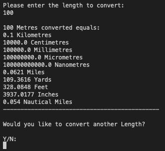
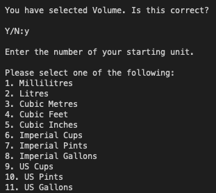
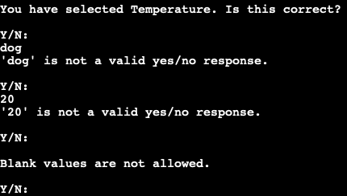

# Chris's Conversion Compendium

Chris's Conversion Compendium is a Python terminal application that runs in the Code Institue mock terminal on Heroku.

Users can choose to convert units of Temperature, Length, Volume or Currency.

Please access the [live application](https://conversion-compendium.herokuapp.com/) via this link.

## Table of Contents

1. [How to use](#how-to-use)
2. [Design Process and Data Models](#design-process-and-data-models)
3. [Features](#features)
    * [Initial Deployment Features](#initial-deployment-features)
        * [Main Menu](#main-menu)
        * [Temperature Conversion](#temperature-conversion)
        * [Length Conversion](#length-conversion)
        * [Volume Conversion](#volume-conversion)
        * [Currency Conversion](#currency-conversion)
    * [Future Features](#future-features)    
4. [Technologies Used](#technologies-used)
5. [Testing](#testing)
6. [Deployment](#deployment)
7. [Credits](#credits)

## How to use

Chris's Conversion Compendium is very intuitive to use. Upon running the program, a user is presented with four numerical choices with each type of parent conversion available displayed first.

When an option is selected, a user has to validate their choice, and then select a starting unit to convert. A user is then prompted to enter their numerical value to be converted. 

Upon hitting enter, the user is then presented with their original unit, and it's conversion into numerous selected popular outputs. The user is then asked would they like to carry out another conversion, or they can return to the main menu.

## Design Process and Data Model

For the inital deployment of the calculator, it was decided to concentrate on four popular conversion types, (Temperature, Length, Volume and Currency) but to design it in such a way that additional conversions could be added at a later date.

The below process flowchart maps out the suggested user journey throughout the site. It was decided to implement a number of validation checks throughout the process to ensure that the user input was the intended one, and to give the user the option to return to a sub-menu, or to the main menu at certain points throughout the process.

Each type of conversion uses varying techniques to return the requested values.

As there were only three types of temperature selected to convert, individual functions for each type of conversion were constructed to deliver the required output.

This method could not be utilised though for the other conversion types due to the large number of functions that would be required to produce each individual output. For this reason, nested dictionaries were used for the length and volume converters. 

Using this method drastically reduced the amount of coding that would be required if one was to use the same method as the temperature conversion. Using nested dictionaries also allows the easy addition of new conversion units, without having to rewrite entire sections of code.

Outputs were limited to four decimal places. It was found that not limiting decimal places produced values on accasion up to 10 or 11 places, and this was adding nothing extra for the user to have this much detail, and presentaionally it looked messy and was hard to read. 

On the flip side, two decimal places did not provide enough data, especially when converting small units into larger units, two decimal places would retun zero in some cases. Four decimal places was found to be a reasonable compromise, in that it returned enough information without cluttering up the outputted result. This could very easily be changed though to more or less decimals points, and is at the same time a matter of personal preference. However for the purposes of this project, four places was the final decision.

The currency converter utilises a similar method, only that the nested dictionary for currency is accessed via a third part module, [Forex-Python](https://forex-python.readthedocs.io/en/latest/#). This dictionary is updated in real time, and means that the developer does not have to rewrite the conversion dictionaries each day to reflect the most accurate rates. The one drawback of this method is that a user has to be online, whereas the other conversions can be run offline as the data is stored locally.

 

[Back to top](#table-of-contents)

 

## Features

### Initial Deployment Features

#### Main Menu

The main menu prints a simple welcome message and then prompts a User to select one of four conversion options, namely temperature, length, volume and currency.

If a user tries to select a number not on the menu, or tries to enter a word, the user is prompted to enter a correct value. This was acheived by using the [PyInputPlus](https://pypi.org/project/PyInputPlus/) third party module. This was used across all user input fields in the application.

Upon selecting an option, a User is asked to confirm their choice. If they select No, the Main Menu is reloaded, and if Yes, the Tempertaure Conversion Selection window opens. A user can confirm using Y, y, yes, YES or Yes and the same for No values.

 

[Back to top](#table-of-contents)

 

#### Temperature Conversion

To convert a Temperature, a user must first select '1' from the Main Menu, and then confirm their choice. 

Once selected, a user is then presented with the Temperature Conversion menu.

The user has a choice from one of three starting units, Celsius, Fahrenheit and Kelvin. Upon making their selection, the user is then prompted to enter their figure. 

Again as before, inputs are limited to numerical inputs (less than 4) only, and any other input will produce a warning message. However, as temperature can be measured in below zero degrees, negative number inputs are allowed.

Once a user inputs a figure and hits enter, they are then provided with their starting figure and the two conversion figures returned. 

Finally the user is asked if they would like to convert another Temperature. If they answer Yes, they are returned to the temperature conversion menu, and if no, they are returned to the application main menu.

 

[Back to top](#table-of-contents)

 

#### Length Conversion

To convert a Length, a user must first select '2' from the Main Menu, and then confirm their choice. 

Once selected, a user is then presented with the Length Conversion menu.

On this occasion, a user has the ability to select from one of eleven starting units, in either metric or imperial.

As before, inputs are limited to numerical inputs (less than 12) only, and any other input will produce a warning message.

Once a user inputs a figure and hits enter, they are then provided with their starting figure and then ten conversion figures are returned.

Finally the user is asked if they would like to convert another Length. If they answer Yes, they are returned to the length conversion menu, and if no, they are returned to the application main menu.

 

[Back to top](#table-of-contents)

 

#### Volume Conversion

To convert a Volume, a user must first select '3' from the Main Menu and then confirm their choice.

Once selected a user is displayed the Volume Conversion menu.

For volume conversions, a user has the ability to select from eleven US, imperial or metric measurement standards. Again, inputs are limited to numerical inputs only.

Once a user inputs their required number, they are then provided with ten conversion figures for that unit.

Once complete, the user is then prompted as to whether or not they would like to carry out another volume conversion, or they can return to the main menu.

 

[Back to top](#table-of-contents)

 

#### Currency Conversion

To convert a Currency, a user must first select '4' from the Main Menu and then confirm their choice.

Once selected, a user is displayed the Currency Conversion menu.

Once a user has selected a starting currency, they are then asked to enter the amount of currency they would like to convert.

The user is then prompted to select the currency they would like to convert into. This differs from the other conversion outputs where they return all of the conversion possibilities. 

This was a conscious decision based on a number of factors, the main one being in a real world application, users seeking currency conversion are usually looking for a specific conversion for a specific purpose, e.g. going on holidays. Providing all of the conversion figures in this instance would be overkill, and make it a little bit more difficult for the user to to see the actual conversion they were after.

The printed result confirms the input and output currency selected along with the actual figure. The user is then asked would they like to carry out another conversion or they can return to the main menu.

As this convertor utilises the Forex-python module, all results are returned via the real time currency rate, so the figure returned is accurate at that exact moment.

 

[Back to top](#table-of-contents)

 

### Future Features

Due the the way the interface is designed, it is very easy to add new units to each of the conversion options without having to rewrite the entire code. 

For example, to add a conversion for Cubic Centimetres to the volume calculator, one merely has to add the conversion rates of Cubic Centimetres in the style of the current dictionaries. This would be driven by user request in the main. In the same fashion, it would also be easy to add other conversions to the calculator, such as Area or Weight/Mass. 

The options are endless for conversions you could add, for example a Tipping Calculator for restaurants, or a Wages Calculator that would return National Insurance outputs etc. 

This could soon become unwieldy though, so there is an argument that specialist calculators such as these would warrant their own standalone interface. This could easily be replicated by cloning this repository and using the necessary conversion calcualtions for each individual application.

 

[Back to top](#table-of-contents)

 

## Technologies Used

* [Lucid Chart](https://www.lucidchart.com/pages/) was used to produce the site flowchart.
* [Python3](https://en.wikipedia.org/wiki/Python_programming_language) was the language used to produce the converter.
* User Input Validation was carried out using the third party module [PyInputPlus](https://pyinputplus.readthedocs.io/en/latest/#).
* [Github](https://github.com/Chris-McGonigle) was used as the repository hosting service.
* [Gitpod](https://www.gitpod.io/) was used as the Code Editor for the site.
* Conversion rates were checked using [Google](https://www.google.co.uk/).
* Live currency conversion is implemented via the [Forex-Python](https://forex-python.readthedocs.io/en/latest/#) Currency Converter third party module.
* [Pep8 Online](http://pep8online.com/) was used to validate the code.

 

[Back to top](#table-of-contents)

 

## Testing

Code was first tested using the PEP8 Online validator. No issues were found in the code as detailed in the screenshot below:

During coding, an issue arose with the line length. Upon checking the PEP8 guidlines, I discovered the 80 character advisory limit. Where possible, Dictionaries were split with the use of parentheses and curly brackets. 

Backslashes were used in string literal statements when the use of brackets or parentheses resulted in spacing errors on the displayed result. As this is not best practise, these were used sparingly and where no other option was found to work as required.

Once deployed, an issue was discovered where the outputs for Length and Volume calculations scrolled off the terminal due to the amount of conversions carried out. This was not an ideal user experience so the new line character was removed from each respective print statement.

Although user input fields are validated using the PyInput Plus model, these were still all tested to ensure they were working in the expected manner. 

For number inputs, fields were tested using words and blank inputs.

For Yes/No expected inputs, fields were tested for numbers, words and blanks

YES/No fields were also tested to ensure that they accepted all possible values (YES, Yes, yes, Y, y, NO, No, N, n)

The full results of manual testing can be seen in the below screenshot. It is also available to [download in excel format](./assets/manual-testing.xlsx).

 

[Back to top](#table-of-contents)

 

## Deployment

This project was deployed using Code Institute's mock Heroku terminal as follows:

1. Create the Gitpod repo via the Github template.
2. Log into Heroku and create a new app.
3. Set Heroku build packs to Python and NodeJS (in that order)
4. Link Github and Heroku accounts
5. Select the main repository and link to the Heroku app
6. Click on deploy.

Please access the [live application](https://conversion-compendium.herokuapp.com/) via this link.

 

[Back to top](#table-of-contents)

 

## Credits

1. I viewed numerous Youtube Tutorials to assist in the production of the temperature conversion module, but specifically videos by [Parvat Computer Technology](https://www.youtube.com/watch?v=nW7vQ5h6_Yk), [Geek Tutorials](https://youtu.be/z-0CmOQAD2k), [NetSecProf](https://youtu.be/T67WzZ2HPpI) and [Dexter Learning](https://youtu.be/pCOkIMm2t70) were the most useful in the production of this section.

2. An article on [Automate the Boring Stuff](https://automatetheboringstuff.com/2e/chapter8/) introduced me to the [PyInputPlus](https://pyinputplus.readthedocs.io/en/latest/) third party module which was created and is maintained by Al Sweigart. This module handles all of the user input validation for the interface. 

3. Conversion factors for length conversion were adapted from a tutorial by [Kovolff](https://youtu.be/0XvNDZmuVE4).

4. To assist in my understanding of accessing values in nested dictionaries I viewed lots of tutorials including ones by [Academind](https://youtu.be/oQfNYqz8pLs), [Data Science Tutorials](https://youtu.be/n9DDnOGntHE) and [Ly So](https://youtu.be/4wMKvr_rd8o). I also received assistance on printing out these values from questions asked on [Stack Overflow](https://stackoverflow.com/).

5. Live currency conversion rates are obtained using the [Forex-Python](https://forex-python.readthedocs.io/en/latest/#) Currency Converter third party module.

 

[Back to top](#table-of-contents)

 