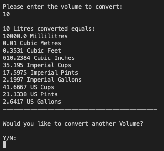

# Chris's Conversion Compendium

Chris's Conversion Compendium is a Python terminal application that runs in the Code Institue mock terminal on Heroku.

Users can choose to convert units of Temperature, Length, Volume or Currency.

You can view the live version of the project here....

## Table of Contents

1. [How to use](#how-to-use)
2. [Features](#features)
    * [Initial Deployment Features](#initial-deployment-features)
        * [Main Menu](#main-menu)
        * [Temperature Conversion](#temperature-conversion)
        * [Length Conversion](#length-conversion)
        * [Volume Conversion](#volume-conversion)
        * 
    * [Future Features](#future-features)    
3. [Technologies Used](#technologies-used)
4. [Testing](#testing)
5. [Deployment](#deployment)
6. [Credits](#credits)

## How to use

Chris's Conversion Compendium is very intuitive to use. Upon running the program, a user is presented with four numerical choices with each type of parent conversion available displayed first.

When an option is selected, a user has to validate their choice, and then select a starting unit to convert. A user is then prompted to enter their numerical value to be converted. 

Upon hitting enter, the user is then presented with their original unit, and it's conversion into numerous selected popular outputs. The user is then asked would they like to carry out another conversion, or they can return to the main menu. 

## Features

### Initial Deployment Features

#### Main Menu

The main menu prints a simple welcome message and then prompts a User to select one of four conversion options, namely temperature, length, volume and currency.

If a user tries to select a number not on the menu, or tries to enter a word, the user is prompted to enter a correct value. This was acheived by using the [PyInputPlus](https://pypi.org/project/PyInputPlus/) third party module. This was used across all user input fields in the application.

Upon selecting an option, a User is asked to confirm their choice. If they select No, the Main Menu is reloaded, and if Yes, the Tempertaure Conversion Selection window opens. A user can confirm using Y, y, yes, YES or Yes and the same for No values.

 

[Back to top](#table-of-contents)

 

#### Temperature Conversion

To convert a Temperature, a user must first select '1' from the Main Menu, and then confirm their choice. 

Once selected, a user is then presented with the Temperature Conversion menu.

The user has a choice from one of three starting units, Celsius, Fahrenheit and Kelvin. Upon making their selection, the user is then prompted to enter their figure. 

Again as before, inputs are limited to numerical inputs (less than 4) only, and any other input will produce a warning message. However, as temperature can be measured in below zero degrees, negative number inputs are allowed.

Once a user inputs a figure and hits enter, they are then provided with their starting figure and the two conversion figures returned. 

Finally the user is asked if they would like to convert another Temperature. If they answer Yes, they are returned to the temperature conversion menu, and if no, they are returned to the application main menu.

 

[Back to top](#table-of-contents)

 

#### Length Conversion

To convert a Length, a user must first select '2' from the Main Menu, and then confirm their choice. 

Once selected, a user is then presented with the Length Conversion menu.

On this occasion, a user has the ability to select from one of eleven starting units, in either metric or imperial.

As before, inputs are limited to numerical inputs (less than 12) only, and any other input will produce a warning message.

Once a user inputs a figure and hits enter, they are then provided with their starting figure and then ten conversion figures are returned.

Finally the user is asked if they would like to convert another Length. If they answer Yes, they are returned to the length conversion menu, and if no, they are returned to the application main menu.

 

[Back to top](#table-of-contents)

 

#### Volume Conversion

To convert a Volume, a user must first select '3' from the Main Menu and then confirm their choice.

Once selected a user is displayed the Volume Conversion menu.

For volume conversions, a user has the ability to select from eleven US, imperial or metric measurement standards. Again, inputs are limited to numerical inputs only.

Once a user inputs their required number, they are then provided with ten conversion figures for that unit.

Once complete, the user is then prompted as to whether or not they would like to carry out another volume conversion, or they can return to the main menu.

 

[Back to top](#table-of-contents)

 

#### Currency Conversion

 

[Back to top](#table-of-contents)

 

### Future Features

 

[Back to top](#table-of-contents)

 

## Technologies Used

* [Lucid Chart](https://www.lucidchart.com/pages/) was used to produce the site flowchart
* [Python3](https://en.wikipedia.org/wiki/Python_(programming_language) was the language used to produce the converter.
* User Input Validation was carried out using the third party module [PyInputPlus](https://pyinputplus.readthedocs.io/en/latest/#)
* [Github](https://github.com/Chris-McGonigle) was used as the repository hosting service
* [Gitpod](https://www.gitpod.io/) was used as the Code Editor for the site
* Conversion rates were checked using [Google](https://www.google.co.uk/)

 

[Back to top](#table-of-contents)

 

## Testing

 

[Back to top](#table-of-contents)

 

## Deployment

This project was deployed using Code Institute's mock Heroku terminal as follows:

1. Create the Gitpod repo via the Github template.
2. Log into Heroku and create a new app.
3. Set Heroku build packs to Python and NodeJS (in that order)
4. Link Github and Heroku accounts
5. Select the main repository and link to the Heroku app
6. Click on deploy.

A live version of the website can be found here....

 

[Back to top](#table-of-contents)

 

## Credits

1. I viewed numerous Youtube Tutorials to assist in the production of the temperature conversion module, but specifically videos by [Parvat Computer Technology](https://www.youtube.com/watch?v=nW7vQ5h6_Yk), [Geek Tutorials](https://youtu.be/z-0CmOQAD2k), [NetSecProf](https://youtu.be/T67WzZ2HPpI) and [Dexter Learning](https://youtu.be/pCOkIMm2t70) were the most useful in the production of this section.

2. An article on [Automate the Boring Stuff](https://automatetheboringstuff.com/2e/chapter8/) introduced me to the [PyInputPlus](https://pyinputplus.readthedocs.io/en/latest/) third party module which was created and is maintained by Al Sweigart. This module handles all of the user input validation for the interface. 

3. Conversion factors for length conversion were adapted from a tutorial by [Kovolff](https://youtu.be/0XvNDZmuVE4).

4. To assist in my understanding of accessing values in nested dictionaries I viewed lots of tutorials including ones by [Academind](https://youtu.be/oQfNYqz8pLs), [Data Science Tutorials](https://youtu.be/n9DDnOGntHE) and [Ly So](https://youtu.be/4wMKvr_rd8o). I also received assistance on printing out these values from questions asked on [Stack Overflow](https://stackoverflow.com/).

 

[Back to top](#table-of-contents)

 